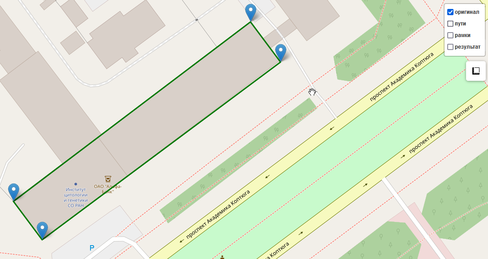
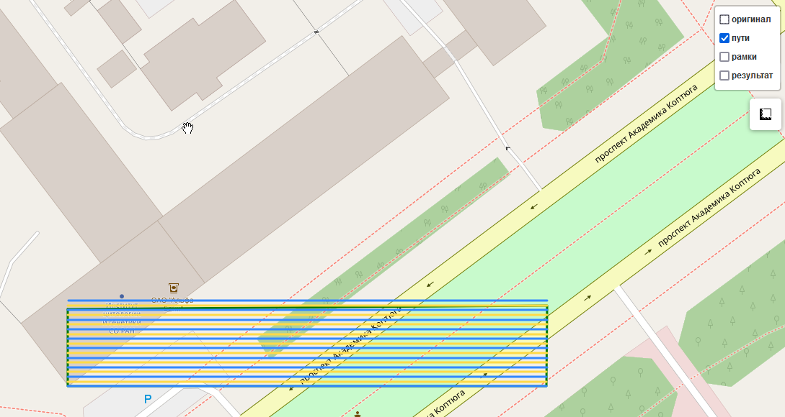
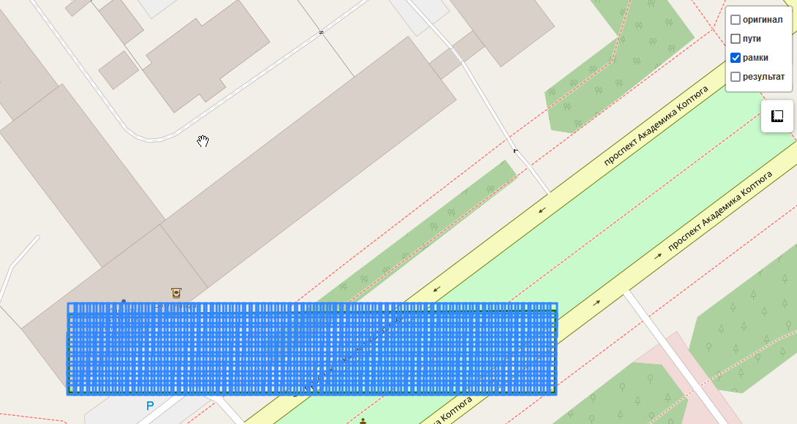
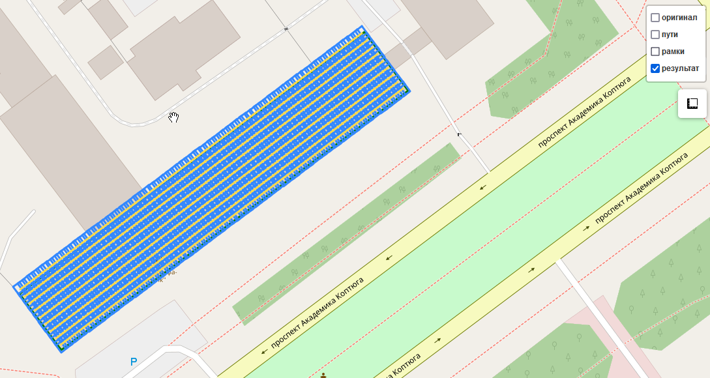
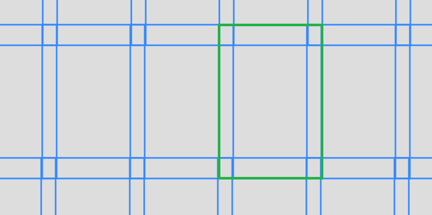
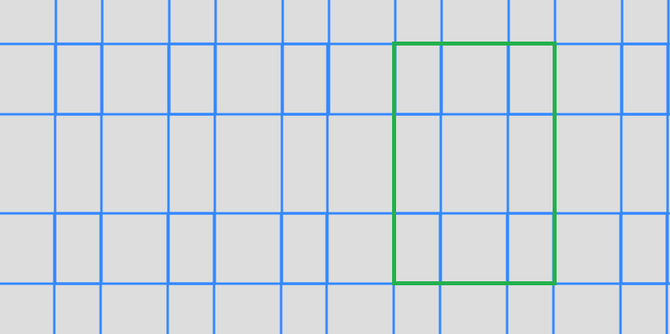

# Инструмент для построения полётного задания по 4-м точкам

Данная программа позволяет построить оптимальный путь. При рассчёте выбирается самая
длинная сторона, вдоль которой будет лететь дрон. В результате получается покрытие нашей 
фигуры прямоугольниками.

Для построения лётного задания нужно выбрать:

- 4 точки
- разрешение и угол обзора камеры дрона
- высоту и скорость полёта
- степень перекрытия изображений


## Процесс работы програмы на примере здания ИЦиГа


Исходная область:


Пути:


Охват кадров:


Результат:



## Перекрытие при 50% площади

25%



50%



## Установка
```
pip install requirements.txt
```

## Запуск
```
python src/main.py
```